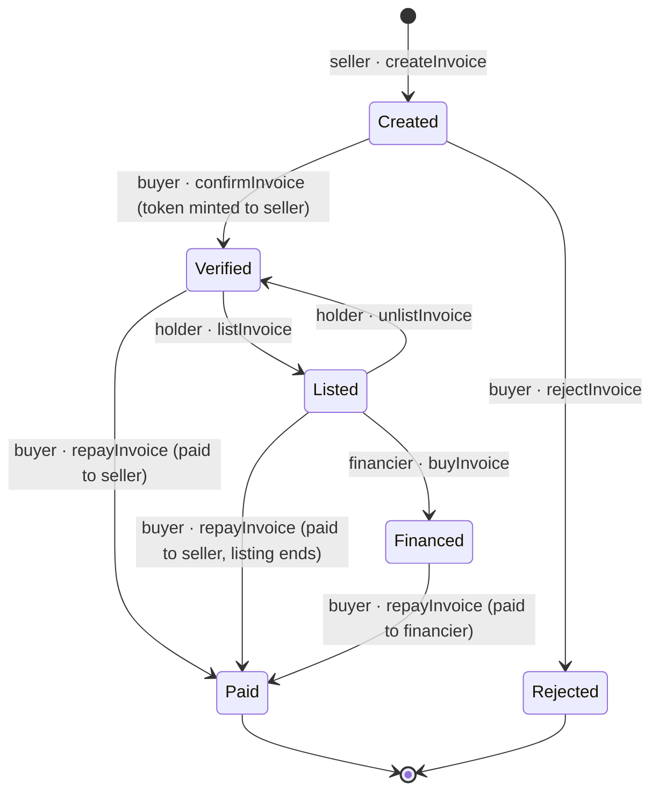
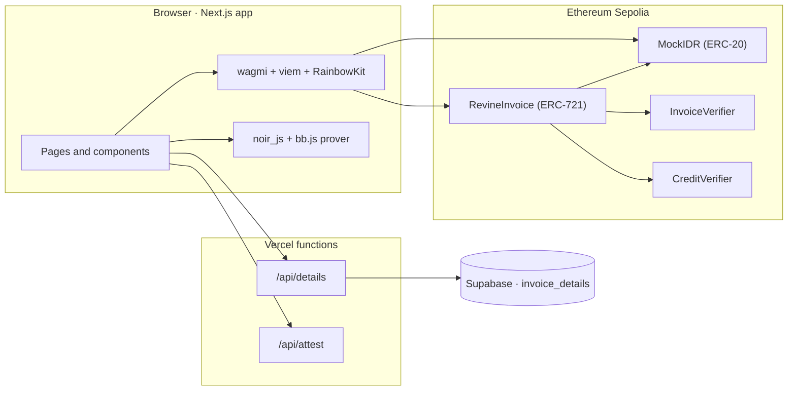

# revine. — Product Requirements (PRD.md)

> **This PRD defines an SLC release (Simple, Lovable, Complete), not an MVP.**
> **Release v26.0, the ETHJKT build. Network: Ethereum Sepolia. Status: living document.**
>
> The scope is tight on purpose, but everything inside it must feel finished.
> - **Simple:** one flow, three roles, one job per screen.
> - **Lovable:** an SME owner with no crypto background understands every screen. Rupiah everywhere, friendly errors, and a clear moment of joy when she gets paid.
> - **Complete:** every step works on Sepolia end to end. No dead ends, no fake buttons, no "coming soon". The only simulated parts are the mock Rupiah token and the demo bank, and both are labeled.

| | |
|---|---|
| Product | revine. — invoice financing for Indonesian SMEs (UMKM), with zero-knowledge privacy |
| Tagline | Turn invoices into opportunities. |
| Event | ETHJKT hackathon, about 12 hours of build time |
| Last updated | 9 Oct 2026 |
| Source of truth | This file. Code follows the PRD. If a decision changes, update this file and §23 Changelog first, then the code. |

**How to read this:** everyone reads §1–§11. Engineers and AI coding agents read everything. In prompts, refer to sections by number ("build §9.6").

**Build day 2:** `PRD-day2.md` is the plan for what's left, who does it and in what order. It never overrides this file.

## Contents

1. Overview
2. Problem
3. Motivation
4. Target users
5. What "done" means for v26.0
6. Scope: in, priority, out
7. Money rules and limits
8. Core flow and invoice statuses
9. Screens and UX flows
10. Brand, copy and language
11. Error states and friendly messages
12. Architecture and tech stack
13. Smart contract spec
14. ZK circuit spec
15. Off-chain data and API routes
16. Frontend ↔ contract interface
17. Team, ownership and build plan
18. Test plan
19. Demo script
20. Known limitations and answers for judges
21. Open questions
22. Decisions log
23. Changelog
- Appendix A. CLAUDE.md and Cursor rule
- Appendix B. Example prompts

---

## 1. Overview

revine. lets small Indonesian businesses get paid **today** for invoices their customers will pay **later**.

A seller creates an invoice, the buyer confirms it's real, and the seller sells it to a financier at a small discount. The financier pays the seller now. On the due date, the buyer pays the full amount through a smart contract, which sends the money to whoever holds the invoice.

Each confirmed invoice is an ERC-721 token: a real-world asset (RWA) representing the right to collect the payment. Zero-knowledge proofs keep the sensitive parts private. Line items, prices and the seller's revenue never go on-chain, but their validity is proven.

**Example:** Bu Sari delivers Rp10.000.000 of rice to a restaurant on 30-day terms. She sells the invoice for Rp9.700.000 and gets the cash today. Thirty days later the restaurant pays Rp10.000.000, which goes straight to the financier, who earns Rp300.000.

What the experience must feel like:
- **Mobile-first.** SME owners run their business from a phone.
- **Plain words first, chain details one click away.** "Get financed", not "mint NFT". Token IDs, fingerprints and proofs live in a collapsed "On-chain details" panel.
- **Rupiah everywhere.** Rp10.000.000, never raw token units.
- **Never a frozen button.** Every on-chain action shows a step-by-step progress view.
- **Live.** Dashboards refresh on their own, so the three demo windows react to each other.
- **One clear "you got paid" moment** when the seller receives cash.
- **Calm, premium fintech look** from the brand board: deep greens, mint accents, lots of white space (§10.1).

## 2. Problem

- Indonesian SMEs that sell to other businesses usually sell on credit: the customer takes the goods today and pays in 30–90 days.
- The seller has already paid for stock, staff and transport, so its cash is stuck in unpaid invoices. It can't restock or take the next order.
- Banks are slow and often reject small businesses with no collateral or credit history. Informal loans are expensive.
- A public blockchain fixes trust and ownership, but it exposes customers, prices and revenue to competitors. That's a deal-breaker for real businesses.

## 3. Motivation

Invoice financing (factoring) already exists and works, but it's mostly out of reach for small businesses. We want an SME owner to turn a confirmed invoice into cash in minutes, with:
- **clear ownership:** anyone can see who holds the right to collect,
- **no double-selling:** the same invoice can't be sold twice on revine.,
- **automatic settlement:** the buyer's payment goes to the right party with no manual reconciliation,
- **privacy:** business details stay private but provably valid.

## 4. Target users

revine. is built **for the seller**. The financier is the other side of the marketplace. The buyer takes part but isn't the customer.

| User | Who exactly | What they want | What they do today |
|---|---|---|---|
| **Seller (primary)** | Micro and small suppliers selling to businesses on 30–90-day terms: rice and food suppliers to restaurants and hotels, office caterers, small garment makers supplying shops, printing shops, distributors to minimarkets | Cash now for invoices due later, without a bank loan | Borrow from family, take expensive informal loans, or turn down orders |
| **Financier (secondary)** | Small financing companies, P2P lenders, investors with idle capital | Short-term returns on verified invoices, and a way to judge risk | Manual checks; hard to verify invoices or catch double financing |
| **Buyer (participant)** | The restaurant, shop or company that owes the invoice | Confirm and pay with minimal effort | Pay the seller by bank transfer on the due date |
| **Judges (demo audience)** | ETHJKT judges | A real problem, a complete working flow, and blockchain and ZK doing real work | — |

**Primary persona: Bu Sari, "Beras Bu Sari", Jakarta.** She supplies rice to restaurants. One restaurant buys about Rp10.000.000 a month on 30-day terms. She needs cash now to restock, but the restaurant pays late. Her bank turned her down: no collateral, no credit history. She uses WhatsApp all day, runs everything from her phone, and has never used crypto.

**Demo cast** (fictional; used in mocks, seed data and the demo):

| Role | Name | Notes |
|---|---|---|
| Seller | Beras Bu Sari | Mock 6-month revenue Rp180.000.000 |
| Buyer | RM Selera Kita | A restaurant ("RM" = rumah makan) |
| Financier | Modal Maju | A small financing company |

**Extra mock cast** (mock data only, so the marketplace, the Companies tab and the buyer payment record have a field; never seeded on Sepolia):

| Role | Name | Notes |
|---|---|---|
| Seller | Toko Rasa Nusantara | Has a credit badge (Rp50 jt+); its profile ad has expired |
| Seller | Konveksi Maju Jaya | Active profile ad; one rejected invoice and one expired listing |
| Seller | Percetakan Sinar Abadi | One financed invoice 40 days overdue, one repaid late |
| Buyer | Kedai Kopi Lestari | Left a financed invoice overdue: **Risky** |
| Buyer | Hotel Puri Asri | One late repayment: **Mixed** |
| Buyer | Katering Ibu Ani | No financed history yet: **New buyer** |

## 5. What "done" means for v26.0

v26.0 is done when **all** of these are true on the deployed Vercel URL:

1. Three wallets on Sepolia can run **create → confirm → list → buy → repay** with no errors, and balances end exactly right: seller +Rp9.700.000, financier −Rp9.700.000 then +Rp10.000.000, buyer −Rp10.000.000.
2. Every on-chain action shows wallet prompt → pending → success or a friendly error, with an Etherscan link.
3. Every list and page has loading, empty and error states.
4. Every screen works at 375px wide (phone) and on desktop.
5. All contracts are verified on Sepolia Etherscan.
6. **(P1)** The seller's credit badge is proven in the browser and verified on-chain. The financier sees the badge but never the revenue number.
7. **(P2)** The invoice proof is verified on-chain at creation, and the buyer's review shows "Details match the on-chain fingerprint ✓".
8. No "coming soon" buttons. Anything that doesn't work is hidden, not shown disabled.
9. The brand is applied everywhere: logo files, Satoshi, color tokens, favicon (§10.1).
10. README and demo video are ready.

## 6. Scope: in, priority, out

### 6.1 In scope, by priority

Build strictly in this order. Don't start a priority until the one above it works on Sepolia.

**P0 — Core flow (must ship)**
- Landing page, role picker, header with role switcher, mIDR balance and faucet
- Seller: dashboard, create invoice with line items, list for financing, unlist
- Buyer: review private details, confirm or reject, pay
- Financier: marketplace, buy, portfolio
- Invoice detail page with status timeline and on-chain details
- Private invoice details stored off-chain, readable only with a wallet signature (§15)
- Light privacy: invoice fingerprint (hash commitment) on-chain, checked by the buyer
- Transaction stepper, network guard, testnet strip, friendly errors (§11)
- Mock mode for frontend development (§16.3)

**Added during the build (in scope, frontend only).** These read on-chain data the contracts already store, or are mock-only. They add nothing to the contracts or the API routes, and they're already built:
- Buyer payment record (§7) on marketplace cards, the buy sheet and the invoice page
- Companies tab with each seller's closed-invoice record (§7, §9.9)
- Profile ads in the Companies tab: UI and mock data only, no payments (§7, §6.2)
- Landing calculator, product stage and tabbed How it works (§9.2)

**P1 — ZK credit badge**
- Mock attester API, credit circuit and verifier, `/seller/credit` page, badge on marketplace cards and the invoice page

**P2 — ZK invoice proof**
- Invoice circuit and verifier, proof generated on create, buyer check by re-running the circuit

**P3 — Polish (only after P0–P2 work)**
- Proving in a Web Worker so the UI never freezes
- Create-invoice draft saved in the browser
- On-chain `tokenURI` metadata so the token looks good in wallets and on Etherscan
- Activity details from contract events

### 6.2 Out of scope for v26.0

If it isn't in §6.1, don't build it. In particular, v26.0 has **none** of these:
- Real money, bank transfers, real stablecoins, fiat on/off-ramps
- Platform fees in contracts, subscriptions, paywalls. (Profile ads, §7, are UI and mock data only: nothing is charged and nothing is on-chain in v26.0.)
- Email/password accounts, sign-up, profile pages, KYC/KYB
- Admin panel, owner or admin functions, pausing, upgradeable contracts
- Off-chain buyers (confirming or paying without a wallet)
- Secondary market: reselling financed invoices or moving invoice tokens between wallets
- Partial financing, partial repayment, auctions, bids or offers
- Buyer credit proofs, ZK double-financing checks, ZK KYC
- End-to-end encryption of invoice details
- Private payments (hiding token transfer amounts or addresses)
- AI credit scoring
- Notifications of any kind (email, push, WhatsApp bot)
- Dark mode, Bahasa Indonesia translation
- Charts and analytics
- Mainnet or any network other than Sepolia
- Gas sponsorship or smart accounts
- Legal documents for assigning receivables

## 7. Money rules and limits

Locked down so nobody, human or AI, invents pricing.

| Rule | Value |
|---|---|
| Payment token | **mIDR** ("Mock Rupiah"), ERC-20 with **0 decimals**: 1 mIDR = Rp1 (simulated) |
| Faucet | `faucet()` mints **100.000.000 mIDR** to the caller. No limit (testnet only) |
| Gas | Users pay Sepolia ETH gas themselves. No sponsorship |
| Invoice amount | Rp100.000 – Rp10.000.000.000, always computed from line items |
| Line items | 1–5 items. Qty: whole number 1–1.000.000. Unit price: whole rupiah, 1–10.000.000.000 |
| Due date | Tomorrow up to 365 days ahead. Stored as 23:59:59 WIB (UTC+7) on that date, in unix **seconds** |
| Asking price | Set with a discount slider, 1%–10% in 0,5% steps, default 3%. Price = amount × (1 − discount), rounded down to whole rupiah. The contract accepts any price from 1 to the amount |
| When financing is allowed | Only before the due date |
| Repayment | Buyer only, full amount, any time after confirmation (early or late). Always paid to the current holder |
| Approvals | Approve the **exact** amount needed, and only if the current allowance is too low. Never unlimited approvals |
| Return shown to financiers | Profit = amount − price. Return % = profit ÷ price × 100. Annualized ≈ return % × 365 ÷ days to due date (simple, labeled "≈ per year, if repaid on time") |
| Worked example | Rp10.000.000 at 3% → price Rp9.700.000 → profit Rp300.000 → 3,09% in 30 days → ≈37,6% per year |
| Credit badge tiers | 6-month revenue above Rp50 jt, Rp100 jt, Rp250 jt or Rp500 jt ("jt" = juta, million) |
| Credit badge validity | 30 days from the attestation time |
| Mock revenue | Demo seller wallet: Rp180.000.000. Any other wallet: Rp120.000.000 |
| Buyer payment record | Computed in the frontend from on-chain invoice data, never stored. Counts only the buyer's invoices that a financier funded (`financedAt > 0`) with a term of at least 7 days: **on time** = paid on or before the due date, **late** = paid after it (with days late), **overdue** = financed, unpaid and past due. On-time rate is weighted by Rupiah amount. Tiers: **Reliable** = at least 3 counted invoices, no overdue, ≥ 90% on time; **Risky** = any overdue, or < 70% on time; **Mixed** = everything else; **New buyer** = no counted invoices yet |
| Company profiles | One row per seller, computed from on-chain invoice data: invoices financed and the share **repaid on time** (paid on or before due, over financed invoices that are paid or overdue), **confirmed by buyers** (confirmed ÷ confirmed + rejected), Rupiah financed to date, invoice size range, open for financing now, average time from listing to financing, top buyers, credit badge |
| Profile ads | A seller can pay to boost their company profile (UI and mock data only in v26.0, no payments). An active ad (now before its end time) pins the profile to the top of the Companies list, ordered by ad tier then bid; expired ads rank as organic. Boosted rows always carry a visible **Ad** label, appear once, and an ad never changes the profile's numbers or record |
| Platform fee | **None in v26.0 contracts.** For the pitch only, proposed business model: 1% fee per financed invoice (§21) |

## 8. Core flow and invoice statuses

### 8.1 The flow

| # | Who | Action | Contract function | Money moves | Invoice token | Status after |
|---|---|---|---|---|---|---|
| 1 | Seller | Create invoice. Details stay private; fingerprint and proof go on-chain | `createInvoice` | — | not minted yet | Created |
| 2 | Buyer | Review private details, confirm | `confirmInvoice` | — | minted to seller | Verified |
| 2b | Buyer | …or reject | `rejectInvoice` | — | — | Rejected |
| 3 | Seller | Prove revenue, publish credit badge (P1) | `submitCreditProof` | — | — | badge on seller |
| 4 | Seller | List with an asking price | `listInvoice` | — | seller | Listed |
| 4b | Seller | Unlist (for example, to change the price) | `unlistInvoice` | — | seller | Verified |
| 5 | Financier | Buy | `buyInvoice` | financier → seller: price | seller → financier | Financed |
| 6 | Buyer | Pay the full amount | `repayInvoice` | buyer → current holder: amount | stays with holder | Paid |

Step 3 can happen at any time. It belongs to the seller, not to one invoice.

### 8.2 State machine



### 8.3 Status values

| Index | Contract enum | Seller sees | Buyer sees | Financier sees |
|---|---|---|---|---|
| 0 | Created | Waiting for buyer | Needs your confirmation | — |
| 1 | Verified | Ready to finance | To pay | — |
| 2 | Rejected | Rejected by buyer | Rejected | — |
| 3 | Listed | Open for financing | To pay | Open for financing |
| 4 | Financed | Financed | To pay | Financed |
| 5 | Paid | Paid | Paid | Paid |

Derived tags (computed in the frontend, not stored on-chain):
- **Overdue:** now is past the due date and the status is Verified, Listed or Financed.
- **Listing expired:** status is Listed and now is past the due date. It can't be bought; the seller can unlist it.

Status is always shown as text plus color, never color alone. Badge colors are in §10.1.

## 9. Screens and UX flows

### 9.0 Routes

This is the complete list. Don't add pages.

| Route | Screen |
|---|---|
| `/` | Landing (§9.2) |
| `/app` | Role picker (§9.3) |
| `/seller` | Seller dashboard (§9.4) |
| `/seller/new` | Create invoice (§9.5) |
| `/seller/credit` | Credit badge, P1 (§9.7) |
| `/buyer` | Buyer dashboard (§9.8) |
| `/financier` | Financier: Marketplace, Companies and Portfolio tabs (§9.9) |
| `/invoice/[id]` | Invoice detail. Public; no wallet needed to view (§9.10) |
| `/api/details`, `/api/attest` | API routes (§15) |

### 9.1 Global layout and shared behavior

- **Testnet strip** at the very top, always visible: "Testnet demo on Sepolia · No real money".
- **Header:** on `brand-900`, running straight into the landing hero and each screen's cover band: logo (`logo-horizontal-dark.svg`, links to `/`), role switcher (pill segmented control: Seller · Buyer · Financier, each navigates to its dashboard), mIDR balance pill, connect button (RainbowKit).
- **App look** (same as the landing, §9.2): each screen opens with a `brand-900` cover band holding its one big number and its tabs as pills; the content sits on white sheets with large rounded corners that overlap the band's bottom edge. Buttons are pills.
- **Balance pill:** shows "Rp100.000.000 mIDR". Clicking opens a menu with "Get 100.000.000 test mIDR" (faucet transaction) and "Get Sepolia ETH for gas" (external link). When Sepolia ETH is below 0,01, show an amber dot and "Low gas balance".
- **Network banner:** if the wallet is on another network, show "revine. runs on Sepolia. You're on {network}." with [Switch to Sepolia]. All actions stay disabled until the wallet switches.
- **Not connected:** dashboards show a centered card, "Connect your wallet to continue", with a connect button. `/` and `/invoice/[id]` work without a wallet.
- **Live data:** invoices refetch every 10 seconds while the tab is visible, and immediately after every successful transaction.
- **Transaction stepper** (one shared component, used by every action): a sheet that lists the steps of the action. Each step shows waiting, in progress, done or failed. It shows an Etherscan link once a transaction hash exists. On failure it shows the friendly message from §11 and [Try again]. It never closes by itself on an error.
- **Success moment:** when one of the seller's invoices changes from Listed to Financed between refetches, show a celebratory toast in the seller view: "You got paid Rp9.700.000 🎉".
- **Mobile:** the primary action is a sticky bottom button; touch targets are at least 44px tall.
- **Lists** use skeleton loaders, not spinners.
- **Addresses** show a demo name when known, otherwise `0x12…ab` with a copy button.
- Light theme only.

### 9.2 Landing `/`

Sections, in order:
1. **Hero**, on a `brand-900` background with the dark logo and large slanted shapes from the mark (§10.1), centered. Eyebrow: "Turn invoices into opportunities." H1: "Get paid today for invoices due next month." Subtitle: "revine. helps Indonesian SMEs sell unpaid invoices to financiers and receive cash now. Ownership and payments are tracked on Ethereum. Your business details stay private with zero-knowledge proofs." Buttons: [Launch app] → `/app`, [How it works] → scrolls down. Below the copy, a **product stage** built from the app's own UI (coded, not screenshots): the financier marketplace in a browser window and the seller's phone. Once on load, the financier buys invoice #12 and the phone shows "You got paid Rp9.700.000 🎉". Reduced motion shows the end state.
2. **Example card**, as a calculator: "Rp10.000.000 invoice, due in 30 days → Rp9.700.000 in your wallet today." is the default, and the sentence updates as the visitor changes the amount, the term (14, 30, 60 or 90 days) and the discount (1–10%, as in §9.6). Shows what the seller gets today, what the financier earns, and what the buyer pays on the due date.
3. **How it works:** the five steps from §8.1, each labeled with its role, as pill tabs. Each step shows a small piece of the app for that step. Tabs advance on their own while the section is in view, pause on hover or focus, and don't advance with reduced motion.
4. **Three roles:** Seller, Buyer, Financier, one line each, shown as "one invoice, three views": invoice #12 as each role sees it, with a link to that view.
5. **Why on-chain:** Clear ownership · No double-selling · Automatic payment.
6. **Private by design:** "Line items, prices and your revenue never go on-chain. Zero-knowledge proofs show they're valid without revealing them." When the section comes into view, the invoice's line items are covered and its fingerprint is written to the on-chain record.
7. **Footer**, on `brand-900` with the dark logo, opening with the supporting line "Capital today. Growth tomorrow." and [Launch app]: "Turn invoices into opportunities." · "Testnet demo on Sepolia. No real money. Built for ETHJKT." · GitHub link.

### 9.3 Role picker `/app`

- If no wallet is connected, connect first.
- Three large cards:
  - **"I sell goods"** — "Get paid now for your invoices" → `/seller`
  - **"I owe an invoice"** — "Confirm and pay invoices sent to you" → `/buyer`
  - **"I have capital"** — "Finance verified invoices and earn" → `/financier`
- Each card also shows what the role looks like on invoice #12: "+Rp9.700.000 today" (seller), "Rp10.000.000 on the due date" (buyer), "+3,09% in 30 days" (financier).
- Remember the last role in browser storage (wrapped in try/catch). On the next visit, `/app` goes straight to it.
- Roles are views, not account types. Any wallet can use any role; the contract enforces who can do what on each invoice.

### 9.4 Seller dashboard `/seller`

- **Cover band** (§9.1): "Hi, **{demo name or 0x12…ab}**", credit badge chip (or a "Get a credit badge" link to `/seller/credit`), primary button [New invoice] (sticky at the bottom on phones).
- **Figures on the cover:**
  - *Ready to finance* (the big number): total amount of my Verified invoices, with the count in the line below it.
  - *Waiting for buyer:* count of my Created invoices.
  - *Cash received:* sum of `askPrice` for my invoices with `financedAt > 0`, plus `faceAmount` for my Paid invoices with `financedAt = 0` (repaid directly to me).
- **Tabs** (pills on the cover, each with its count): All · Waiting for buyer · Ready to finance · Listed · Financed · Paid. Rejected invoices appear under All.
- **Invoice row:** buyer initial and name, #id, due ("in 28 days" or "Overdue 3 days"), status badge, amount with the date of the last change. Tapping the row opens `/invoice/[id]`. At most one button:
  - Verified → [Get financed] (opens §9.6)
  - Listed → [Unlist], plus a "Listing expired" tag if past due
  - anything else → no button
- Newest first.
- **Empty state:** "No invoices yet. Create your first one — it takes about a minute." [New invoice]

### 9.5 Create invoice `/seller/new`

One page with four sections:
1. **Buyer:** wallet address input. When the address is known, show the demo name ("✓ RM Selera Kita"). In demo mode, show [Use demo buyer].
2. **Items:** 1–5 rows, each with Item name (required, max 60 characters) · Qty · Unit price (Rp) · line total (automatic). [+ Add item] disappears at 5 rows; each row has a remove icon. The **invoice total** is computed, shown large, and is the invoice amount. There is no separate amount field.
3. **Due date:** chips "30 days" (default) · "60 days" · "90 days", plus a date picker.
4. **Description** (optional, max 280 characters), for example "Delivered 8 Oct, PO #0815".

**Side panel** (below the form on mobile): "What's public vs private".
- Public on-chain: amount, due date, seller and buyer addresses, fingerprint.
- Private 🔒: items, prices, description. "Only you and your buyer can see these."

**Demo mode:** [Fill demo invoice] fills buyer = RM Selera Kita; items "Beras premium (kg)" 500 × Rp15.000 and "Beras medium (kg)" 200 × Rp12.500 (total Rp10.000.000); 30 days; description "Delivered 8 Oct, PO #0815".

**On [Create invoice], the stepper runs:**
1. Verify your wallet: free signature, skipped if signed in the last 24 hours (§15.3)
2. Create privacy proof: P2 only. After 10 seconds, add "This can take up to a minute."
3. Save private details: `POST /api/details`. Keep a local copy in browser storage until this succeeds.
4. Confirm in your wallet: `createInvoice`
5. Waiting for Sepolia
6. Done

If step 3 fails, stop there: "Couldn't save the private details. Nothing was sent on-chain." [Try again]. If the user tries to leave the page during steps 2–5, show the browser's leave warning.

**Success screen:** "Invoice #12 created ✓ — sent to RM Selera Kita for confirmation." Then "Next: once they confirm, you can get it financed." Buttons: [Share via WhatsApp] (a `https://wa.me/?text=` link with "Please confirm invoice #12 on revine.: {url}"), [Copy link], [View invoice], [Back to dashboard].

Validation runs inline on blur and on submit, using the messages in §11.

### 9.6 Get financed (sheet, opened from a seller row or the invoice page)

- Shows the amount, due date and days left.
- Discount slider, 1%–10% in 0,5% steps, default 3%.
- Live numbers: **"You receive today: Rp9.700.000"** and "Financier earns: Rp300.000 (3,09% in 30 days)".
- [List for financing] → stepper: confirm in wallet → Waiting for Sepolia → "Listed! Financiers can now see invoice #12."
- **Unlist** (from the row): confirmation dialog "Unlist invoice #12? Financiers won't see it until you list it again." → stepper.
- To change the price: unlist, then list again. The sheet says so in one line.

### 9.7 Credit badge `/seller/credit` (P1)

- **Intro:** "Show financiers your business is healthy, without showing your numbers."
- **Step 1, get your revenue attested:** [Connect demo bank] → `POST /api/attest` → card: "Demo Bank · Revenue, last 6 months: Rp180.000.000 · Only you can see this · Attested {time}".
- **Step 2, pick what to prove:** tiers Rp50 jt+ · Rp100 jt+ · Rp250 jt+ · Rp500 jt+. Tiers above the attested revenue are disabled with "Your revenue doesn't reach this tier." The default is the highest tier that qualifies.
- **Step 3, [Create proof & publish badge]** → stepper: Create privacy proof (in this browser) → Confirm in your wallet → Waiting for Sepolia → Done.
- **Result:** badge preview "✓ Revenue above Rp100 jt · last 6 months · ZK-verified · valid until 7 Nov 2026", with "Financiers see this badge. Your exact revenue never goes on-chain."
- **Existing badge:** show it. When fewer than 7 days are left, show [Refresh badge]. When expired: "Your badge expired. Create a new one."

### 9.8 Buyer dashboard `/buyer`

**Cover band** (§9.1): "Hi, **{name}**"; the big number is *You owe* (sum of amounts To pay), with the count and how many are overdue; figures *To confirm* (count) and *Next due*.

Tabs (pills on the cover). Tapping a row opens `/invoice/[id]`:
- **To confirm:** Created invoices where buyer = me. Row: seller name, amount, due date, "sent 2 h ago", [Review].
- **To pay:** Verified, Listed or Financed invoices where buyer = me. Overdue first, then soonest due. Row: seller, amount, due countdown, "Pay to: {current holder name}", [Pay].
- **History:** Paid and Rejected.

**Review sheet**
- Header: amount, seller, due date.
- Private details, after wallet verification (§15.3): items table and description.
- Integrity check: "✓ Details match the on-chain fingerprint", computed in the browser (§14.2). If it fails: "⚠ These details don't match the on-chain record. Don't confirm — contact the seller." Confirm is then disabled.
- Above the buttons: "By confirming, you agree you owe Rp10.000.000, due 7 Nov 2026, to whoever holds this invoice on that date."
- [Confirm invoice] → stepper. [Reject] → dialog "Reject invoice #12? This can't be undone." → stepper.

**Pay sheet**
- "You pay Rp10.000.000 to {holder name} (current invoice holder)."
- Balance check. If short: "You need Rp10.000.000 mIDR but have Rp2.000.000." [Get test mIDR]
- Re-read the holder right before sending. The contract always pays whoever holds the invoice when the transaction lands, so the success message uses the recipient from the `InvoicePaid` event.
- Stepper: Allow revine. to use Rp10.000.000 (skipped if the allowance is already enough) → Confirm payment in your wallet → Waiting for Sepolia → "Paid ✓ Invoice #12 is settled."

**Empty states:** To confirm: "Nothing to confirm. Invoices sent to your wallet show up here." To pay: "No invoices to pay." History: "No past invoices yet."

### 9.9 Financier `/financier`

**Cover band** (§9.1), shown on every tab: "Hi, **{name}**"; the big number is *Expected* (amounts still due to me); figures *Invested* · *Received* · *Profit so far* (definitions under Portfolio). Tabs (pills on the cover): Marketplace · Companies · Portfolio. On Marketplace, the sort menu and the "Credit badge only" toggle sit next to the tabs.

**Marketplace tab**
- Shows Listed invoices that aren't past due, where seller ≠ me.
- Sort: Highest return (default) · Soonest due · Newest. Toggle: "Credit badge only".
- **Card:** amount; price; "+Rp300.000 · 3,09%"; "≈37,6% per year, if repaid on time"; due "in 30 days · 7 Nov 2026"; seller name with credit badge chip (or "No credit badge"); buyer name with "Buyer confirmed ✓" and the buyer's payment record (§7), e.g. "Reliable · 6 paid on time, 1 late" or "New buyer · no payment record yet"; "Details private 🔒"; [Finance this invoice].
- **Empty state:** "No invoices open for financing right now. New ones appear here automatically."

**Buy sheet**
- "You pay Rp9.700.000 now. You receive Rp10.000.000 when RM Selera Kita pays on 7 Nov 2026."
- Buyer's payment record in full (§7): on time, late (days), overdue, how many different sellers, and the history between this seller and this buyer. For a new buyer: "New buyer · no payment record yet. Price the risk: this is their first financed invoice on revine."
- Risk note, always shown: "If the buyer doesn't pay, you can lose money. revine. doesn't guarantee repayment."
- Balance check, with a faucet link if short.
- Stepper: Allow revine. to use Rp9.700.000 → Confirm in your wallet → Waiting for Sepolia → "You now hold invoice #12 ✓".
- If someone else bought it first (`WrongStatus` in this flow): "Someone else just financed this invoice." [Back to marketplace], and the list refreshes.

**Companies tab**
- One row per seller (§7 Company profiles), styled after P2P merchant lists: initial avatar (green dot when the seller has an open listing), name, credit badge chip, "Financed 6 (83% repaid on time)" and "100% confirmed by buyers", Rupiah financed to date as the big figure, invoice size range, open for financing now, top buyers, average time to get financed, and [See].
- Profile ads (§7) pin to the top with an **Ad** label; everyone else follows by Rupiah financed.
- **[See] opens the company's record:** a sheet listing every closed invoice (sold, repaid, rejected or expired) with its timestamps (created, confirmed or rejected, listed, financed, due, paid) and a plain status-and-reason line, e.g. "Repaid 12 days after the due date", "Buyer hasn't paid: 40 days past due", "Rejected by the buyer; no reason is recorded on-chain", "Listed but not financed before the due date". Each links to its invoice page.

**Portfolio tab**
- Invoices where holder = me and `financedAt > 0` (Financed and Paid).
- **Figures** (on the cover): Invested (sum of prices paid) · Expected (amounts still due) · Received (amounts repaid) · Profit so far (amount − price, summed over Paid invoices).
- **Row:** buyer initial and name, #id, price paid, due countdown or Overdue tag (or the repaid date), status, amount due. Tapping the row opens `/invoice/[id]`; no button.
- **Empty state:** "You haven't financed any invoices yet." [Browse marketplace]

### 9.10 Invoice detail `/invoice/[id]`

Public page: anyone can see the public data without a wallet.
- **Cover band** (§9.1): "Invoice **#12**", status badge, Overdue tag if any; the amount as the big number with the due date; seller, buyer (with their payment record, §7) and current holder; the role's action button (below).
- **Facts:** amount, due date, seller, buyer, current holder, and price → amount (if listed or financed).
- **Timeline:** Created → Confirmed (or Rejected) → Listed → Financed → Paid, each with its time from the contract timestamps. Future steps are grayed out.
- **Private details:** the seller and buyer see [Show private details] → wallet verification → items, description, integrity check. Everyone else sees "🔒 Line items and description are private. Only the seller and buyer can see them."
- **On-chain details** (collapsed by default): token ID, contract address (Etherscan link), fingerprint (shortened, with copy), invoice proof status ("Verified on-chain at creation ✓" once P2 ships, "Fingerprint only" before), seller credit badge.
- **Action button** by role, same rules as the dashboards: Get financed / Review / Pay / Finance this invoice.
- **Unknown id:** "Invoice not found." [Back to app]

## 10. Brand, copy and language

### 10.1 Brand

Source: the designer's revine. brand board. The designer owns the brand; these are the values to build with.

**Name and tagline**
- The name is always lowercase with the dot: **revine.** In the logo, the dot is mint.
- Tagline: **"Turn invoices into opportunities."**
- Supporting lines for landing sections, the deck and social posts: "Unlock the value of what's owed." · "Capital today. Growth tomorrow." · "Invoice financing for a more resilient tomorrow."

**Logo files** (exported as SVG by the designer into `apps/web/public/brand/`)

| File | Use |
|---|---|
| `logo-horizontal-light.svg` | Light sections |
| `logo-horizontal-dark.svg` | Header, landing hero and footer (all on `brand-900`) |
| `mark.svg` | Icon-only mark for loading states and tight spaces |
| `mark-flat.svg` | Single-color mark for the favicon and anything under 32px, where the gradient turns muddy |
| `favicon.ico`, `apple-icon.png`, `og-image.png` | Mark on a `brand-900` rounded square, like the app icon on the board |

Never redraw the logo in CSS or code. The slanted parallelogram shapes from the mark may be reused as large decorative shapes in the landing hero, as on the brand board. No other illustrations.

**Colors**

| Token | Hex | Use |
|---|---|---|
| `brand-900` (primary dark green) | #0B1F1A | Header, landing hero, app cover bands and footer backgrounds, Paid badge, hover state of primary buttons |
| `brand-700` (secondary green) | #16634B | Primary buttons with white text (about 7:1 contrast), links, focus rings |
| `mint` (accent green) | #35CB9B, to be confirmed (§21) | Logo dot, highlights, Listed badge, accents on dark backgrounds |
| `bg` (light background) | #F8FAF6 | App background |
| `ink` (dark text) | #1F2A26 | Body text and headings |
| `ink-muted` (muted text) | #6B6F6C | Secondary text (about 4,9:1 on `bg`) |
| `danger` | Tailwind red-600 until the designer adds one | Errors, Rejected badge |
| `warning` | Tailwind amber-100 background with amber-800 text, until the designer adds one | Overdue and Listing expired tags, low-gas and slow-network notes |

- **Never use `mint` for text on a light background.** Its contrast there is about 2:1. Use `brand-700` for green text.
- Map these into shadcn's theme variables in whatever format your shadcn version uses. Cards and borders keep shadcn defaults (white cards on `bg`) until the designer adds tokens.

**Status badges**

| Status | Style |
|---|---|
| Created | `ink-muted` outline, `ink-muted` text |
| Verified | `brand-700` outline, `brand-700` text |
| Rejected | `danger` fill, white text |
| Listed | `mint` fill, `brand-900` text |
| Financed | `brand-700` fill, white text |
| Paid | `brand-900` fill, white text |
| Overdue, Listing expired (extra tag) | `warning` style |

**Typography**
- **Satoshi**, free from Fontshare. Commit the font files and load them with `next/font/local`, so nothing depends on an outside font server.
- Weights: 400 for body text, 500 for labels and buttons, 700 for headings and big amounts. The board also shows Light and Semibold; skip them unless the designer uses them.
- Right-align amounts in tables and use `tabular-nums` where the font supports it, so Rupiah columns line up.

**Look and feel**
- Calm, premium fintech: generous white space, white cards on `bg`, rounded corners of about 12–16px.
- The landing hero and footer sit on `brand-900` with the dark logo. All app screens use the light theme (no dark mode, §6.2).

### 10.2 Copy and language

- UI language: **English**. Numbers and money use **Indonesian formatting** via `Intl.NumberFormat('id-ID')`: Rp10.000.000, 3,09%. Dates look like "7 Nov 2026".
- Short sentences. Talk to the user as "you".
- No crypto jargon on the main screens:

| Don't say | Say |
|---|---|
| Mint NFT | Invoice confirmed |
| NFT / ERC-721 | invoice token (only inside "On-chain details") |
| Approve token spending | Allow revine. to use Rp… |
| Commitment / hash | fingerprint |
| ZK proof | privacy proof |
| Face value | invoice amount |
| Ask price | price |
| Token owner | current holder |
| mIDR | test Rupiah (mIDR) on first mention per screen, then mIDR |
| Transaction reverted | the matching message from §11 |

## 11. Error states and friendly messages

Use these strings exactly. Each error says what happened and what to do next. Wallet cancellations are neutral (gray), not red.

**Wallet and network**

| When | Message | Action |
|---|---|---|
| Not connected | Connect your wallet to continue. | [Connect wallet] |
| Wrong network | revine. runs on Sepolia. You're on {network}. | [Switch to Sepolia] |
| User rejects a signature or transaction | You cancelled in your wallet. Nothing was sent. | [Try again] |
| Not enough Sepolia ETH | You need a little Sepolia ETH to pay the network fee. | [Get Sepolia ETH] |
| Not enough mIDR | You need {amount} mIDR but have {balance}. | [Get test mIDR] |
| RPC busy or timeout | The network is busy. Retrying… | Retry 3 times automatically, then [Try again] |
| Transaction pending over 60 seconds | Still waiting for Sepolia. This can take a minute when the network is busy. | Etherscan link |

**Create invoice form**

| When | Message |
|---|---|
| Buyer address invalid | That doesn't look like a wallet address (0x… with 42 characters). |
| Buyer is your own wallet | You can't send an invoice to yourself. Enter your buyer's wallet. |
| Item name empty | Give this item a name. |
| Qty not a whole number from 1 to 1.000.000 | Quantity must be a whole number from 1 to 1.000.000. |
| Unit price invalid | Unit price must be a whole rupiah amount above 0. |
| Total out of range | Invoices must be between Rp100.000 and Rp10.000.000.000. |
| Due date today or earlier | Pick a due date after today. |
| Due date more than 365 days ahead | Pick a due date within the next 12 months. |

**Privacy proofs and private details**

| When | Message | Action |
|---|---|---|
| Wallet verification declined | We need a free signature to show private invoice details. It doesn't send a transaction. | [Try again] |
| Proof takes over 10 seconds | Creating your privacy proof… this can take up to a minute on slower devices. | — |
| Proof generation fails | We couldn't create the privacy proof. Try again — if it keeps failing, refresh the page. | [Try again] |
| Proof rejected on-chain | The network rejected the privacy proof. Please create it again. | [Try again] |
| Details missing (buyer view) | The seller's private details haven't arrived yet. Ask the seller to open the invoice and upload them again. | — |
| Details missing (seller view, local copy exists) | Your private details didn't upload. | [Upload again] |
| Supabase table missing | Private invoice storage isn't set up. Run the Supabase migration, then try again. | Apply `supabase/migrations/202610090001_invoice_details.sql` |
| Supabase server key rejected | Private invoice storage credentials were rejected. Check the server-only Supabase key. | Update the server environment and restart |
| Fingerprint mismatch | ⚠ These details don't match the on-chain record. Don't confirm — contact the seller. | Confirm disabled |
| Someone other than seller or buyer asks for details | Only the seller and buyer can see these details. | — |

**Credit badge**

| When | Message |
|---|---|
| Attester unavailable | The demo bank is offline. Try again in a minute. |
| Tier above attested revenue | Your revenue doesn't reach this tier. |
| Badge expired | Your badge expired. Create a new one. |
| Attestation older than 30 days | This attestation is older than 30 days. Connect the demo bank again. |

**Contract custom errors.** Decode reverts with viem (`ContractFunctionRevertedError`, `data.errorName`) and map:

| Error name | Message |
|---|---|
| `NotBuyer` | Only the buyer on this invoice can do this. |
| `NotHolder` | Only the current holder of this invoice can do this. |
| `WrongStatus` | This invoice changed while you were looking. Refresh to see its latest status. (In the buy flow: "Someone else just financed this invoice.") |
| `InvalidBuyer` | Check the buyer's wallet address. |
| `InvalidAmount` | Check the invoice amount. |
| `InvalidDueDate` | Pick a due date after today. |
| `CommitmentUsed` | This invoice already exists on revine. |
| `InvalidProof` | The network rejected the privacy proof. Please create it again. |
| `InvalidPrice` | The price must be above Rp0 and no more than the invoice amount. |
| `PastDue` | This invoice is past its due date and can't be financed. |
| `CannotBuyOwn` | You can't finance your own invoice. |
| `TransfersDisabled` | Invoice tokens can only change hands through revine. |
| `AttestationExpired` | This attestation is older than 30 days. Connect the demo bank again. |
| Anything else | Something went wrong and the action didn't go through. [Try again] |

## 12. Architecture and tech stack

### 12.1 Overview



There is no separate backend server. The backend is the contracts, two Next.js API routes and one Supabase table.

### 12.2 Stack

| Layer | Choice | Notes |
|---|---|---|
| Frontend | Next.js (App Router) + TypeScript | Hosted on Vercel Hobby (free). Vercel root directory: `apps/web` |
| UI | Tailwind CSS + shadcn/ui | Brand colors, Satoshi font and logo files from §10.1 |
| Wallet | wagmi + viem + RainbowKit | RainbowKit needs a free WalletConnect (Reown) project ID |
| Data fetching | TanStack Query (comes with wagmi) | 10-second polling, refetch after transactions |
| Forms | react-hook-form + zod | |
| Contracts | Solidity + Foundry + OpenZeppelin v5 | |
| ZK | Noir (nargo) + Barretenberg (bb), UltraHonk | noir_js + bb.js in the browser; Solidity verifiers generated by bb |
| Network | Ethereum Sepolia, chain ID 11155111 | |
| RPC | Alchemy free tier | Restrict the key to your domains if the provider allows it |
| Off-chain data | Supabase free tier | Accessed only from API routes |
| Server functions | Next.js API routes on Vercel | Attester and private details |
| Explorer | Sepolia Etherscan | Verify every contract |

### 12.3 Repo structure

```
revine/
├─ PRD.md                      ← this file
├─ PRD-day2.md                 ← build plan for day 2 (never overrides PRD.md)
├─ PRODUCT.md, DESIGN.md       ← design context (DESIGN.md needs regenerating after the 9 Oct redesign)
├─ CLAUDE.md                   ← Appendix A
├─ .cursor/rules/revine.mdc    ← Appendix A
├─ README.md
├─ apps/web/                   ← Next.js app (Vercel root)
│  ├─ public/brand/            ← logo SVGs, favicon, social image (§10.1)
│  └─ src/
│     ├─ fonts/                ← Satoshi files (§10.1)
│     ├─ app/                  ← routes from §9.0, plus app/api/details and app/api/attest
│     │  └─ _landing/          ← landing pieces: hero stage, calculator, How it works, privacy demo
│     ├─ components/           ← Cover, Ledger, Panel, StatusBadge, RupiahAmount, TxStepper, ActionSheet, sheets/,
│     │                          CreditBadgeChip, BuyerRecordChip, MoneyBridge, NetworkBanner, TestnetStrip, BalancePill, WalletButton
│     ├─ lib/
│     │  ├─ types.ts           ← §16.1
│     │  ├─ hooks/             ← §16.2 (mock and real versions side by side)
│     │  ├─ mock.ts            ← §16.3 data; mock-actions.ts simulates the contract
│     │  ├─ contracts.ts       ← §16.4 (day 2)
│     │  ├─ demo-names.ts      ← address → demo name
│     │  ├─ fingerprint.ts     ← text hash and light-mode fingerprint (§14.2, day 2)
│     │  ├─ format.ts          ← Rupiah, percent, dates, return math (§7)
│     │  ├─ buyer-record.ts    ← buyer payment record (§7)
│     │  ├─ company-profiles.ts← company profiles, profile ads, closed-invoice outcomes (§7, §9.9)
│     │  ├─ messages.ts        ← §11 strings
│     │  └─ *.test.ts          ← unit tests (node --test)
│     └─ zk/                   ← compiled circuit JSON + prover.ts
├─ contracts/                  ← Foundry project
│  ├─ src/                     ← MockIDR.sol, RevineInvoice.sol, verifiers/
│  ├─ test/
│  └─ script/Deploy.s.sol
└─ circuits/
   ├─ invoice/                 ← Nargo.toml, src/main.nr
   └─ credit/
```

### 12.4 Environment variables

| Name | Where | Secret? |
|---|---|---|
| `NEXT_PUBLIC_CHAIN_ID` = 11155111 | Vercel + local | no |
| `NEXT_PUBLIC_RPC_URL` | Vercel + local | no (domain-restricted) |
| `NEXT_PUBLIC_WALLETCONNECT_PROJECT_ID` | Vercel + local | no |
| `NEXT_PUBLIC_USE_MOCKS` = true / false | local / Vercel | no |
| `NEXT_PUBLIC_DEMO_MODE` = true / false | Vercel + local | no |
| `SUPABASE_URL` | server only | no |
| `SUPABASE_SERVICE_ROLE_KEY` | server only | **yes** |
| `ATTESTER_PRIVATE_KEY` | server only | **yes** |
| `SEPOLIA_RPC_URL`, `DEPLOYER_PRIVATE_KEY`, `ETHERSCAN_API_KEY` | `contracts/.env`, never committed | **yes** |

Contract addresses and ABIs live in `src/lib/contracts.ts`, not in env variables.

### 12.5 Gotchas (read before coding)

1. **Pin ZK versions.** nargo, bb, `@noir-lang/noir_js` and `@aztec/bb.js` must be compatible versions. Pick them together in hour 1 and don't upgrade during the hackathon.
2. **EVM-compatible proofs.** Proofs for the Solidity verifier must be generated with bb's keccak/EVM option, in both the CLI (verification key, verifier) and bb.js (proving). Default proofs won't verify on-chain.
3. **Public input order** = the `pub` parameters of `main` in declaration order, then the return value. The contract builds this array itself and never accepts public inputs from the user.
4. **Browser-only ZK.** Load noir_js and bb.js only on the client (dynamic import inside a client component, or a Web Worker). Test proof generation on the deployed Vercel URL in the first hours, not just on localhost.
5. **Don't add COOP/COEP headers** unless single-threaded proving is too slow. They enable multi-threaded proving but can break wallet popups and external images.
6. **mIDR has 0 decimals.** Never multiply by 10¹⁸.
7. **Seconds, not milliseconds.** The contract uses unix seconds; `Date.now()` is milliseconds. Due dates are 23:59:59 WIB.
8. **Use bigint for chain values** (viem returns bigint). Format with `Intl.NumberFormat('id-ID')`.
9. **Don't build history from event logs.** Free RPC plans often limit log queries. The timeline uses the timestamps stored in the invoice struct.
10. **Supabase:** Row Level Security on with no policies; the service-role key only on the server, never with a `NEXT_PUBLIC_` prefix. Free projects pause after about a week without activity, so open the dashboard before judging.
11. **Attester signature format:** raw 32-byte digest (no Ethereum message prefix), 64-byte r‖s, low-s (§14.3).
12. **Deploy the real verifiers to Sepolia early.** Catch contract-size and gas surprises before the last hours.

## 13. Smart contract spec

### 13.1 Contracts

| Contract | Purpose |
|---|---|
| `MockIDR` | ERC-20 "Mock Rupiah", symbol mIDR, `decimals()` = 0, `faucet()` |
| `RevineInvoice` | ERC-721 "revine. Invoice", symbol RVI. All invoice logic |
| `InvoiceVerifier` | Generated by bb from the invoice circuit (P2). Before P2: `AlwaysTrueVerifier` |
| `CreditVerifier` | Generated by bb from the credit circuit (P1). Before P1: `AlwaysTrueVerifier` |

- Constructor: `RevineInvoice(IERC20 midr, IVerifier invoiceVerifier, IVerifier creditVerifier)`, all **immutable**. Switching from `AlwaysTrueVerifier` to a real verifier means redeploying `RevineInvoice` and updating `contracts.ts`.
- No owner, no admin functions, no pause, no upgrades.
- Verifier interface (matches the bb-generated verifiers):
  `interface IVerifier { function verify(bytes calldata proof, bytes32[] calldata publicInputs) external view returns (bool); }`

### 13.2 Data

```solidity
enum Status { Created, Verified, Rejected, Listed, Financed, Paid }

struct Invoice {
    address seller;
    address buyer;
    uint256 faceAmount;   // mIDR, 0 decimals = rupiah
    uint256 askPrice;     // 0 until listed; after financing = price paid
    bytes32 commitment;   // fingerprint (invoice circuit output in P2)
    uint64  dueDate;      // unix seconds
    uint64  createdAt;
    uint64  respondedAt;  // buyer confirmed or rejected
    uint64  listedAt;
    uint64  financedAt;
    uint64  paidAt;
    Status  status;
}

struct CreditBadge {
    uint256 threshold;    // rupiah
    uint64  attestedAt;
    uint64  verifiedAt;   // 0 = no badge
}

mapping(uint256 => Invoice) invoices;      // ids start at 1
mapping(bytes32 => bool) usedCommitment;
mapping(address => CreditBadge) public creditBadge;
```

- Invoice IDs start at 1. Token ID = invoice ID. The token is minted when the buyer confirms.
- "Holder" means `_ownerOf(id)` (OpenZeppelin v5; returns `address(0)` before minting, while `ownerOf` reverts).

### 13.3 Functions

| Function | Caller | Requires | Effects | Event |
|---|---|---|---|---|
| `createInvoice(address buyer, uint256 faceAmount, uint64 dueDate, bytes32 commitment, bytes proof) returns (uint256 id)` | anyone (becomes seller) | buyer ≠ 0 and ≠ caller; 0 < faceAmount ≤ 10.000.000.000; now < dueDate ≤ now + 366 days; commitment unused; invoice proof valid (§14.2) | store invoice as Created; mark commitment used | `InvoiceCreated` |
| `confirmInvoice(uint256 id)` | buyer | status Created | status Verified; mint token `id` to seller | `InvoiceConfirmed` |
| `rejectInvoice(uint256 id)` | buyer | status Created | status Rejected | `InvoiceRejected` |
| `listInvoice(uint256 id, uint256 askPrice)` | holder | status Verified; 0 < askPrice ≤ faceAmount; now < dueDate | status Listed; save askPrice | `InvoiceListed` |
| `unlistInvoice(uint256 id)` | holder | status Listed | status Verified; askPrice = 0 | `InvoiceUnlisted` |
| `buyInvoice(uint256 id)` | anyone except the holder | status Listed; now < dueDate | status Financed; then mIDR `transferFrom(caller → holder, askPrice)`; then move token holder → caller | `InvoiceFinanced` |
| `repayInvoice(uint256 id)` | buyer | status Verified, Listed or Financed | status Paid; then mIDR `transferFrom(buyer → holder, faceAmount)` | `InvoicePaid` |
| `submitCreditProof(uint256 threshold, uint64 attestedAt, bytes proof)` | anyone (becomes seller) | attestedAt ≤ now; now − attestedAt ≤ 30 days; credit proof valid (§14.3) | save badge for caller | `CreditVerified` |
| `MockIDR.faucet()` | anyone | — | mint 100.000.000 mIDR to caller | `Transfer` |

**Views**
- `invoiceCount() returns (uint256)`
- `getInvoice(uint256 id) returns (InvoiceView)`
- `getInvoices(uint256 offset, uint256 limit) returns (InvoiceView[])` for IDs offset+1 … min(offset+limit, count). The frontend loads everything with one call; fine up to about 200 invoices.
- `InvoiceView` = all `Invoice` fields + `id` + `holder` (`address(0)` before confirmation).
- `creditBadge(address)`. A badge is valid when `verifiedAt > 0` and now − attestedAt ≤ 30 days.

**Events**

```solidity
event InvoiceCreated(uint256 indexed id, address indexed seller, address indexed buyer, uint256 faceAmount, uint64 dueDate, bytes32 commitment);
event InvoiceConfirmed(uint256 indexed id);
event InvoiceRejected(uint256 indexed id);
event InvoiceListed(uint256 indexed id, uint256 askPrice);
event InvoiceUnlisted(uint256 indexed id);
event InvoiceFinanced(uint256 indexed id, address indexed financier, uint256 price);
event InvoicePaid(uint256 indexed id, address indexed recipient, uint256 amount);
event CreditVerified(address indexed seller, uint256 threshold, uint64 attestedAt);
```

**Custom errors:** `NotBuyer`, `NotHolder`, `WrongStatus`, `InvalidBuyer`, `InvalidAmount`, `InvalidDueDate`, `CommitmentUsed`, `InvalidProof`, `InvalidPrice`, `PastDue`, `CannotBuyOwn`, `TransfersDisabled`, `AttestationExpired`. Each maps to a message in §11.

### 13.4 Rules

- The seller is always `msg.sender`. The contract builds ZK public inputs itself from function arguments and `msg.sender`.
- Update state before calling token transfers.
- The invoice token moves **only** through `buyInvoice`. Override `_update` and revert with `TransfersDisabled` when `auth != address(0)`. In OpenZeppelin v5, user-initiated transfers pass a non-zero `auth`, while `_mint` and internal `_transfer` pass zero.
- Paid invoices keep their token as a record (no burn).
- Wrap verifier calls in try/catch. A `false` result or a revert inside the verifier both become `InvalidProof`.
- `createInvoice` returns the new ID; the frontend reads it from the `InvoiceCreated` event in the receipt.
- Deploy script order: MockIDR → verifiers (or `AlwaysTrueVerifier`) → RevineInvoice. Then mint 100.000.000 mIDR to each demo wallet, verify all contracts on Etherscan, and print the addresses for `contracts.ts`.

## 14. ZK circuit spec

### 14.1 General

- Two Noir circuits: `circuits/invoice` and `circuits/credit`. Compile with nargo. Generate verification keys and Solidity verifiers with bb, using the keccak/EVM option.
- Proofs are generated in the browser: noir_js computes the witness, bb.js `UltraHonkBackend` generates the proof with the keccak/EVM option.
- Public input order = `pub` parameters of `main` in declaration order, then the return value. The contract builds the `bytes32[]` in exactly that order.
- Encoding: addresses as `uint256(uint160(addr))`, integers as their uint256 value, each as `bytes32`.
- After every circuit change, the circuit owner copies the compiled JSON to `apps/web/src/zk/`, regenerates the verifier and redeploys.

### 14.2 Invoice circuit (P2): "the hidden itemized invoice matches the public record"

| Input | Visibility | Type |
|---|---|---|
| `seller` | public | Field (address) |
| `buyer` | public | Field (address) |
| `face_amount` | public | u64 |
| `due_date` | public | u64 |
| `qty[5]` | private | u64; unused rows = 0 |
| `unit_price[5]` | private | u64 |
| `text_hash` | private | Field |
| `salt` | private | Field (random, 31 bytes) |
| returns `commitment` | public | Field |

Constraints:
- Σ qty[i] × unit_price[i] = face_amount, and face_amount > 0
- qty[i] ≤ 1.000.000 and unit_price[i] ≤ 10.000.000.000
- commitment = hash(seller, buyer, face_amount, due_date, qty[0..4], unit_price[0..4], text_hash, salt) using Poseidon2 or Pedersen from the Noir standard library. It's only ever computed inside the circuit, so the frontend never re-implements it.

`text_hash` = the first 31 bytes of SHA-256 of `JSON.stringify({ description, itemNames })`, built with that fixed key order and read as a Field. Seller and buyer compute it with the same helper in `fingerprint.ts`.

The amount range and due date are public, so the contract checks them (§13.3), not the circuit.

Contract call: `createInvoice(buyer, faceAmount, dueDate, commitment, proof)` with public inputs `[msg.sender, buyer, faceAmount, dueDate, commitment]`.

**Buyer check:** the buyer's browser fetches the details, computes `text_hash`, runs `noir.execute(...)` (witness only, no proving, so it's fast) and compares the returned value with the on-chain commitment. An execution failure also counts as a mismatch.

**Before P2 (light mode):** the contract uses `AlwaysTrueVerifier` and the proof is `0x`. The fingerprint is `keccak256(abi.encode(seller, buyer, faceAmount, dueDate, qty[5], unitPrice[5], textHash, salt))`, computed by the same `fingerprint.ts` helper for seller and buyer. In light mode the UI and the pitch say "fingerprint". Never claim a proof that isn't verified on-chain.

### 14.3 Credit circuit (P1): "my attested revenue is above the threshold"

| Input | Visibility | Type |
|---|---|---|
| `seller` | public | Field (address) |
| `threshold` | public | u64 |
| `attested_at` | public | u64 |
| `revenue` | private | u64 |
| `signature` | private | [u8; 64] (r ‖ s) |
| attester public key | constant in the circuit | x and y, [u8; 32] each |

Constraints:
- digest = SHA-256(seller as 20 bytes ‖ revenue as 8 bytes big-endian ‖ attested_at as 8 bytes big-endian)
- the ECDSA secp256k1 signature over digest is valid for the hardcoded attester public key
- revenue ≥ threshold

Use the SHA-256 implementation that matches your pinned Noir version; in recent versions it lives in a separate library rather than the standard library.

Contract call: `submitCreditProof(threshold, attestedAt, proof)` with public inputs `[msg.sender, threshold, attestedAt]`.

The attester (§15.2) signs the **raw 32-byte digest**, with no Ethereum message prefix, and returns a 64-byte r‖s signature with low-s. A byte-layout mismatch between the API and the circuit is the most likely way this breaks, so write one `nargo test` using a signature produced by the real API code.

Changing the attester key means recompiling the circuit, regenerating the verifier and redeploying.

### 14.4 What stays private and what's public

| Private (never on-chain) | Public (on-chain) |
|---|---|
| Line items: names, quantities, unit prices | Invoice amount and due date |
| Description | Seller, buyer and financier addresses |
| Seller's exact revenue | Every mIDR transfer and its amount |
| Salt | Fingerprint, credit tier, attestation time |

## 15. Off-chain data and API routes

### 15.1 Supabase table `invoice_details`

| Column | Type | Notes |
|---|---|---|
| `commitment` | text, primary key | 0x… fingerprint; links the row to the on-chain invoice |
| `seller` | text | lowercase address |
| `buyer` | text | lowercase address |
| `face_amount` | bigint | |
| `due_date` | bigint | unix seconds |
| `items` | jsonb | `[{ name, qty, unitPrice }]`, max 5 |
| `description` | text | max 280 characters |
| `salt` | text | 0x… |
| `created_at` | timestamptz | default `now()` |

- Row Level Security **on**, with **no policies**, so the public key can't read anything. Only the API routes use the service-role key.
- Rows are written before the `createInvoice` transaction, keyed by fingerprint. If the transaction never happens, the orphan row is harmless.

### 15.2 API routes

| Route | Input | Checks | Output |
|---|---|---|---|
| `POST /api/details` | details + wallet verification | signer = seller; verification ≤ 24 h old; 1–5 items; insert only, never overwrite another seller's row | `{ ok: true }` |
| `GET /api/details?commitment=0x…` | header `x-revine-auth` | signer is the row's seller or buyer | the details row |
| `POST /api/attest` | `{ seller }` | valid address | `{ seller, revenue, attestedAt, signature }` |

The attester's revenue comes from a constant map in code (`DEMO_REVENUE`): demo seller → 180.000.000, any other address → 120.000.000. It never signs a number the user typed. No wallet verification is needed for `/api/attest`, because the proof is bound to the seller's address and only that wallet can submit it.

### 15.3 Wallet verification (for private details)

Message to sign:

```
revine. wants to verify your wallet.
Address: 0xabc…
Issued at: 2026-10-08T10:00:00.000Z
This free signature doesn't send a transaction.
```

- The client keeps `{ message, signature }` per address in session storage (wrapped in try/catch) and sends it base64-encoded in `x-revine-auth` (GET) or in the body (POST).
- The server verifies it with viem's `verifyMessage`, checks the address matches, and checks that "Issued at" is within the last 24 hours and not more than 5 minutes in the future.

## 16. Frontend ↔ contract interface

This section and §13 are the agreement between frontend and backend. Change them here first, then tell each other.

### 16.1 Types (`src/lib/types.ts`)

```ts
export type Address = `0x${string}`;

export type InvoiceStatus = 'Created' | 'Verified' | 'Rejected' | 'Listed' | 'Financed' | 'Paid';
// Index = contract enum value
export const STATUSES: InvoiceStatus[] = ['Created', 'Verified', 'Rejected', 'Listed', 'Financed', 'Paid'];

export interface Invoice {
  id: bigint;
  seller: Address;
  buyer: Address;
  holder: Address | null;   // null until the buyer confirms (token not minted yet)
  faceAmount: bigint;       // mIDR, 0 decimals = rupiah
  askPrice: bigint;         // 0n until listed; after financing = price paid
  commitment: `0x${string}`;
  dueDate: number;          // unix seconds
  createdAt: number;        // unix seconds; 0 = not yet (same for the fields below)
  respondedAt: number;
  listedAt: number;
  financedAt: number;
  paidAt: number;
  status: InvoiceStatus;
}

export interface CreditBadge {
  threshold: bigint;        // rupiah
  attestedAt: number;
  verifiedAt: number;       // 0 = no badge
  isValid: boolean;         // verifiedAt > 0 && now - attestedAt <= 30 days
}

export interface InvoiceItem {
  name: string;
  qty: number;
  unitPrice: number;        // whole rupiah
}

export interface InvoiceDetails {
  commitment: `0x${string}`;
  seller: Address;
  buyer: Address;
  faceAmount: number;
  dueDate: number;
  items: InvoiceItem[];     // 1–5
  description: string;
  salt: `0x${string}`;
}

export interface CreateInvoiceInput {
  buyer: Address;
  items: InvoiceItem[];
  dueDate: number;          // unix seconds, 23:59:59 WIB
  description: string;
}

export interface Attestation {
  revenue: number;
  attestedAt: number;
  signature: `0x${string}`;
}

export type TxStep =
  | 'verify-wallet'
  | 'proving'
  | 'saving-details'
  | 'approving'
  | 'wallet'
  | 'pending'
  | 'success'
  | 'error';

export type OnStep = (step: TxStep, info?: { hash?: `0x${string}`; error?: string }) => void;
```

### 16.2 Hooks (`src/lib/hooks/`)

```ts
useWallet(): {
  address?: Address;        // undefined when not connected
  isConnected: boolean;
  isConnecting: boolean;    // true while the wallet reconnects on page load
  chainId?: number;
  networkName?: string;     // for "You're on {network}." (§11)
  isWrongNetwork: boolean;  // connected, but not on Sepolia (11155111)
  switchToSepolia: () => void;
} // in mock mode: the demo account picked in WalletButton
useInvoices(): { invoices: Invoice[]; isLoading: boolean; error: Error | null; refetch: () => void } // polls every 10 s
useProfileAds(): { ads: { seller: Address; tier: number; bid: number; endsAt: number }[]; isLoading: boolean } // off-chain; mock-only in v26.0
useInvoice(id: bigint): { invoice: Invoice | null; isLoading: boolean; error: Error | null }
useCreditBadge(address?: Address): { badge: CreditBadge | null; isLoading: boolean }
useBalances(address?: Address): { midr: bigint; eth: bigint; isLoading: boolean }
useInvoiceDetails(commitment: `0x${string}`): {
  details: InvoiceDetails | null;
  matches: boolean | null;  // fingerprint check result; null until loaded
  load: () => Promise<void>; // asks for wallet verification if needed
  isLoading: boolean;
  error: Error | null;
}
useRevineActions(): {
  createInvoice(input: CreateInvoiceInput, onStep: OnStep): Promise<bigint>; // returns the new invoice id
  confirmInvoice(id: bigint, onStep: OnStep): Promise<void>;
  rejectInvoice(id: bigint, onStep: OnStep): Promise<void>;
  listInvoice(id: bigint, askPrice: bigint, onStep: OnStep): Promise<void>;
  unlistInvoice(id: bigint, onStep: OnStep): Promise<void>;
  buyInvoice(id: bigint, onStep: OnStep): Promise<void>;
  repayInvoice(id: bigint, onStep: OnStep): Promise<void>;
  getAttestation(): Promise<Attestation>;
  publishCreditBadge(threshold: bigint, attestation: Attestation, onStep: OnStep): Promise<void>; // calls submitCreditProof
  faucet(onStep: OnStep): Promise<void>;
}
```

Every action reports its progress through `onStep`, and `TxStepper` renders it. Components never call wagmi or fetch directly; they only use these hooks.

### 16.3 Mock mode

- With `NEXT_PUBLIC_USE_MOCKS=true`, the hooks read from `src/lib/mock.ts`, and actions walk through each step with about 1-second delays.
- Mock data must include: one invoice in every status, one overdue Financed invoice, one expired listing, one seller with a credit badge and one without, and an account with no invoices.
- Mocks use exactly the same types as real data. Swapping mocks for the real hooks must not require changing any component.
- Mock data also includes the extra mock cast from §4 and two profile ads (one active, one expired). It's shared across browser tabs (localStorage `revine.mockData.v3`); the connected mock account is per tab (sessionStorage).
- The account menu lets you pick a demo account and simulate a wrong network or a cancelled wallet prompt, and has [Reset demo data] and [Load worst-case data] (long text, amounts at the §7 limits, about 200 invoices).

### 16.4 `src/lib/contracts.ts`

Addresses and ABIs (exported `as const` so viem and wagmi infer types) for `MockIDR` and `RevineInvoice`, plus the deployment block. It's the single source of truth, updated by Jovan after every deploy.

## 17. Team, ownership and build plan

### 17.1 Ownership

| Person | Owns | Main files |
|---|---|---|
| **Jovan** (blockchain and backend) | Contracts, verifiers, deployment, wallet setup (wagmi, RainbowKit), contract hooks, API routes, Supabase, attester | `contracts/`, `src/lib/hooks/`, `src/lib/contracts.ts`, `src/app/api/` |
| **Frontend dev** | All pages and components, mock data, stepper and UI states, browser prover module, responsive layout, Vercel | `src/app/` pages, `src/components/`, `src/lib/mock.ts`, `src/lib/format.ts`, `src/zk/` |
| **Designer** (product and UI/UX) | Brand board, logo SVG exports and favicon, design tokens, wireframes, copy review, SME research, business model | `public/brand/`, design files, theme tokens |
| **Pitch lead** (pitch and demo) | Deck, demo script, demo video, README, submission | `README.md`, pitch files |
| **Noir circuits** | **Open, decide in hour 1 (§21).** Proposed: Jovan | `circuits/` |

### 17.2 Build plan (H0 = start of building)

| Time | Jovan | Frontend dev | Designer | Pitch lead |
|---|---|---|---|---|
| H0–1 | Repo, Foundry, pin ZK versions, Supabase project | Next.js + Tailwind + shadcn, deploy to Vercel, route skeleton | Export logo SVGs and favicon (§10.1); confirm the accent hex | Deck outline, demo story |
| H1–3 | Contracts + tests with `AlwaysTrueVerifier` | Every screen on mock data; TxStepper; hello-world proof working on the Vercel URL | Wireframes for the three dashboards | Problem research slides |
| H3–5 | Deploy to Sepolia; hooks; `/api/details` | Switch to real hooks. **Milestone 1: full core flow on Sepolia** | Empty, loading and error state visuals | README draft |
| H5–8 | Credit circuit, attester, verifier, redeploy | Credit page, prover module, badge UI. **Milestone 2: credit badge on-chain** | Badge and proof visuals | Privacy and ZK slides |
| H8–10 | Invoice circuit, verifier, redeploy | Proof on create, buyer check. **Milestone 3: invoice proof on-chain** | QA pass | Rehearse demo script |
| H10–11 | Seed demo data, Etherscan verification | Mobile pass, error states, copy check against §10–11 | QA | Record backup demo video |
| H11–12 | Freeze: bug fixes only | Freeze | — | Final video, submission |

**Cut rules:**
- If Milestone 1 isn't done by H5, everyone helps on Milestone 1.
- If Milestone 2 isn't done by H8, stop new ZK work, polish P0 + P1, and present the invoice proof (P2) as roadmap.

## 18. Test plan

### 18.1 Contracts (Foundry)

- **Full flow:** create → confirm → list → buy → repay, asserting final balances (seller +9.700.000, financier +300.000 net, buyer −10.000.000) and the token holder after each step.
- **Repay paths:** repay while Verified → seller receives the amount; while Listed → listing ends, seller receives it; while Financed → financier receives it.
- **Every revert:** non-buyer confirm/reject/repay (`NotBuyer`); non-holder list/unlist (`NotHolder`); confirming twice and other wrong-status calls (`WrongStatus`); self-invoice and zero buyer (`InvalidBuyer`); zero or too-large amount (`InvalidAmount`); past or too-far due date (`InvalidDueDate`); reused commitment (`CommitmentUsed`); price 0 or above amount (`InvalidPrice`); list or buy after due date (`PastDue`); holder buying own listing (`CannotBuyOwn`); old attestation (`AttestationExpired`).
- **Transfers blocked:** `transferFrom` and `safeTransferFrom` revert with `TransfersDisabled`.
- **Verifier failures:** a mock verifier that returns false and one that reverts both give `InvalidProof`.
- **Real verifiers:** save a real proof and its public inputs from bb as a fixture; `verify` passes, and fails with one public input changed.

### 18.2 Circuits (`nargo test`)

- **Invoice:** valid items pass; wrong sum fails; zero total fails; out-of-bounds qty or price fails; changing any input changes the commitment.
- **Credit:** a signature produced by the real attester code passes; revenue below threshold fails; tampered revenue fails; a signature from another key fails.

### 18.3 Frontend

- **Unit tests** (`npm test` in `apps/web`, node:test): format and return math, buyer payment record, company profiles, profile ad ranking and closed-invoice outcomes. Keep them green.
- **Mock mode:** every screen in every state: loading, empty, error, each status, overdue, expired listing.
- **Real mode on the Vercel URL** (not just localhost): full flow with three wallets in three browser profiles; both proofs generate; wrong-network banner; insufficient mIDR; rejected signature; 375px width.
- **Copy check:** every error string matches §11.

### 18.4 Pre-demo checklist

- Each demo wallet has at least 0,2 Sepolia ETH and Rp100.000.000 mIDR.
- One seeded invoice in each status, as a backup if a live transaction is slow.
- The demo seller already has a valid credit badge, as a backup.
- Contracts verified; `contracts.ts` points to the final deployment; mocks off; demo mode on.
- Backup demo video recorded.

## 19. Demo script (about 3 minutes)

Setup: one laptop, three browser profiles side by side: Beras Bu Sari (seller), RM Selera Kita (buyer), Modal Maju (financier).

| Time | Window | Show | Say |
|---|---|---|---|
| 0:00 | Landing | Hero: the product stage plays the "You got paid" moment; the calculator below | "Bu Sari delivered Rp10 juta of rice. The restaurant pays in 30 days. She needs cash today." |
| 0:20 | Seller | New invoice → Fill demo invoice → point at "public vs private" → Create | "The line items stay private. Her browser creates a zero-knowledge proof that they add up to the public total." |
| 0:50 | Buyer | To confirm → Review → "✓ matches fingerprint" → Confirm | "The restaurant sees the real details and checks them against the on-chain fingerprint." |
| 1:10 | Seller | Dashboard shows Ready to finance → Credit badge → demo bank Rp180 jt → prove Rp100 jt+ | "She proves her revenue is above Rp100 juta without revealing the number." |
| 1:35 | Seller | Get financed → 3% → "You receive Rp9.700.000 today" → List | "She picks her price and sees exactly what she gets." |
| 1:50 | Financier | Marketplace card: return, credit badge, buyer's payment record, "Details private" → Finance | "The financier sees what they need to judge risk, not Bu Sari's business secrets." |
| 2:10 | Seller | "You got paid Rp9.700.000 🎉" toast, balance up | "Cash today, not in 30 days." |
| 2:20 | Buyer | To pay → Pay Rp10.000.000 → goes to Modal Maju | "On the due date the restaurant pays, and the contract routes the money to the financier automatically." |
| 2:40 | Invoice page | Timeline, Etherscan link, proofs verified | "Every step is on-chain and verifiable." |
| 2:50 | Closing | Roadmap | "Next: buyers paying by bank transfer, encrypted details, buyer credit proofs and cross-platform double-financing checks." |

## 20. Known limitations and answers for judges

| Question | Honest answer |
|---|---|
| Isn't everything public on Ethereum? | Amounts, due dates, addresses and payments are public. Line items, prices, descriptions and revenue are not; ZK proofs show they're valid. |
| What stops a seller and buyer faking an invoice together? | In v26.0, only the buyer's confirmation. A real launch needs verified business identities, buyer reputation, and cross-checks with tax e-invoices (e-Faktur). |
| What if the buyer doesn't pay? | The financier takes that risk, and the app says so before every purchase. Overdue invoices are flagged. A real launch could add recourse to the seller or credit insurance. |
| Is selling an invoice legally valid? | In Indonesia, assigning receivables (cessie) needs proper legal documents and typically notice to the debtor. The token tracks who holds the right to collect; it doesn't replace the paperwork. The buyer's confirmation step is a natural place to capture that notice in a real version. |
| Why a mock attester? | It stands in for a bank or accounting system that signs revenue data. ZK proves facts about signed data; it can't make made-up numbers true. |
| Who can see the private details? | The seller, the buyer, and revine.'s server in v26.0. End-to-end encryption is next. |
| Why not real rupiah? | It's a testnet demo. A real launch would use a licensed rupiah stablecoin or bank rails. |

## 21. Open questions (decide in hour 1)

1. **Who writes the Noir circuits?** Proposed: Jovan writes the circuits and verifiers; the frontend dev owns the browser prover module.
2. **UI language:** English (current decision) or Bahasa Indonesia?
3. **Business-model fee for the pitch:** 1% per financed invoice (proposed)?
4. **Live demo:** who drives which wallet?
5. **Accent green:** the brand board lists it as #3SCB9B, which isn't a valid hex code. This PRD assumes #35CB9B. The designer confirms.

## 22. Decisions log

| Date | Decision | Why |
|---|---|---|
| 8 Oct 2026 | Product name is **revine.** (not InvoiceFlow) | Team decision |
| 8 Oct 2026 | Network: Ethereum **Sepolia** | Free test ETH, well supported by wallets and tools |
| 8 Oct 2026 | ZK is in scope, built in order: core flow → credit badge (P1) → invoice proof (P2) | A working flow matters more than unfinished ZK |
| 8 Oct 2026 | The buyer is on-chain (has a wallet) in v26.0 | Confirmation and payment run through the contract with no middleman |
| 8 Oct 2026 | mIDR has 0 decimals | Same integers in circuits, contracts and UI; no conversion bugs |
| 8 Oct 2026 | Invoice tokens move only through `buyInvoice` | No double-selling, no listing confusion; secondary market is later |
| 8 Oct 2026 | Repayment any time after confirmation, always to the current holder | Simple and always correct |
| 8 Oct 2026 | Credit badge is per seller, tiered, valid 30 days, revenue from the mock attester only | Easy to understand and demo; the attester never signs typed numbers |
| 8 Oct 2026 | Private details are access-controlled by wallet signature, not end-to-end encrypted | Fits the time budget; earlier briefs said "encrypted", which v26.0 doesn't do |
| 8 Oct 2026 | The invoice circuit doesn't check dates or amount ranges | They're public, so the contract checks them more cheaply |
| 8 Oct 2026 | Verifier addresses are immutable; redeploy to switch | No admin keys to explain to judges |
| 8 Oct 2026 | No fees and no admin functions in contracts | Keeps contracts small and trustless for the demo |
| 8 Oct 2026 | English UI, Indonesian number formatting, light theme only | Judges and demo video; less work |
| 8 Oct 2026 | Timeline from struct timestamps, not event logs | Free RPC plans limit log queries |
| 8 Oct 2026 | Brand from the designer's brand board: Satoshi, dark-green palette, mint accent, tagline "Turn invoices into opportunities." | One consistent look across app, deck and video |
| 8 Oct 2026 | Mint accent is never used as text on light backgrounds | About 2:1 contrast, hard to read |
| 8 Oct 2026 | Companies tab with transparent closed-invoice records, and labelled profile ads (§7, §9.9) | Investors asked to see each company's full history, failures included; ads are the proposed monetization, kept honest with an Ad label and no effect on any record. UI and mock data only, no payments in v26.0 |
| 8 Oct 2026 | Buyer payment record (§7) shown to financiers, computed from on-chain repayment timestamps | Financiers' main doubt is whether the buyer pays; the chain already holds tamper-proof due and paid dates. Only financier-funded invoices count, so a seller and buyer can't inflate it with fake invoices |
| 8 Oct 2026 | Added `useWallet()` to the hooks in §16.2 | Header, wallet button, network banner and dashboards need the connected address and network without calling wagmi directly |
| 9 Oct 2026 | Landing (§9.2) is Pluang-inspired: centered hero over the product, interactive example, tabbed steps | Owner request; shows the product working instead of describing it |
| 9 Oct 2026 | Seller, buyer, financier and every other screen use the landing's look; the header turns `brand-900` with the dark logo | Owner request; one visual language from the landing into the app |
| 9 Oct 2026 | List rows open their invoice when tapped; only real actions get a button (no [View]) | Fewer buttons per row and a bigger touch target |
| 9 Oct 2026 | Features added during the build (buyer payment record, Companies tab, profile ads, landing calculator) are in scope as listed in §6.1 | They were built on owner request and read data the contracts already store, so they add no contract or API work |
| 9 Oct 2026 | Pin the proof toolchain: Nargo 1.0.0-rc.4, `@noir-lang/noir_js` 1.0.0-rc.4-5a3abf2.nightly, and `@aztec/bb.js` 5.3.0-nightly.20261009 | Keep the circuit artifacts, browser prover, and Solidity verifiers compatible |
| 9 Oct 2026 | Credit proof uses synthetic Demo Bank attestations; invoice and credit verifiers are generated locally, while proof mode stays off until the matching contracts are deployed | Keep demo evidence and undeployed contracts clearly distinguished from live financial data |
| 9 Oct 2026 | Public Vercel deployment is held until the owner requests it | Finish local Sepolia and proof readiness without publishing the app |

## 23. Changelog

| Version | Date | Change |
|---|---|---|
| v26.0 | 8 Oct 2026 | First PRD, from the team chat, the planning session and the brand board |
| v26.0 | 8 Oct 2026 | §16.2: added `useWallet()` (connected address and network; in mock mode, the demo account picked in WalletButton) |
| v26.0 | 8 Oct 2026 | §7, §9.9, §9.10: buyer payment record and the "New buyer" state |
| v26.0 | 8 Oct 2026 | §7, §9.9, §16.2: Companies tab, closed-invoice record, profile ads and `useProfileAds()` |
| v26.0 | 9 Oct 2026 | §9.2: landing redesign (Pluang-inspired): centered hero with a coded product stage, calculator example card, tabbed How it works, roles as "one invoice, three views", footer CTA |
| v26.0 | 9 Oct 2026 | §9.1, §10.1: app screens follow the landing's look (dark header and cover band, overlapping white sheets, pill buttons and tabs) |
| v26.0 | 9 Oct 2026 | End-of-day-1 cleanup so the PRD matches the build: §4 extra mock cast; §6.1 features added during the build; §6.2 profile ads note; §9.0 Companies tab; §9.3 role cards; §9.4, §9.8, §9.9, §9.10 cover bands, pill tabs and tap-to-open rows (no [View]); §12.3 repo structure; §16.3 mock data and account menu; §18.3 unit tests; §19 demo beats; pointer to `PRD-day2.md` |
| v26.0 | 9 Oct 2026 | Implemented real MetaMask/Sepolia hooks, private invoice-details API, local credit and invoice proof pipelines, generated Solidity verifiers, and proof integration fixtures; fixed the production build. Updated `PRD-day2.md` with the remaining external gates. |

When something changes: update the relevant section, add a row to §22 if it's a decision, add a row here, then sync Appendix A if a rule changed.

---

## Appendix A. CLAUDE.md and Cursor rule

Put this in `CLAUDE.md` at the repo root:

```md
# CLAUDE.md — revine.

Read PRD.md before starting any task. It is the source of truth.

- Release v26.0 is an SLC release. Build only what PRD §6.1 lists, in priority order. Never build anything in §6.2 "Out of scope".
- Network: Sepolia only. mIDR has 0 decimals (1 mIDR = Rp1). Contract times are unix seconds.
- Use the types in src/lib/types.ts and the hooks in src/lib/hooks/. Components never call wagmi or fetch directly.
- With NEXT_PUBLIC_USE_MOCKS=true, use src/lib/mock.ts.
- Brand: use the color tokens, Satoshi and logo SVGs from PRD §10.1. Never use the mint accent as text on light backgrounds. Never redraw the logo.
- UI copy follows PRD §10.2. Error messages use the exact strings in §11.
- Routes are only those in §9.0.
- If code and PRD disagree, stop and ask. If a decision changes, update PRD.md (§22, §23) first.
```

Put the same bullets in `.cursor/rules/revine.mdc`:

```md
---
description: revine. project rules — PRD.md is the source of truth
alwaysApply: true
---
Read @PRD.md before starting any task.
(same bullets as CLAUDE.md)
```

## Appendix B. Example prompts

- "Using PRD §9.6 and the copy in §10–11, build the Get financed sheet with shadcn's Sheet, wired to `useRevineActions().listInvoice` in mock mode."
- "From PRD §13, write `RevineInvoice.sol` and Foundry tests covering every rule in §13.4 and every case in §18.1."
- "Build `src/lib/mock.ts` with the data required by PRD §16.3, using the demo cast from §4."
- "Check my latest commit: do the error messages in the buy flow match PRD §11 exactly?"
- "From PRD §14.3, write the credit circuit and a `nargo test` that uses a signature from the `/api/attest` code."
