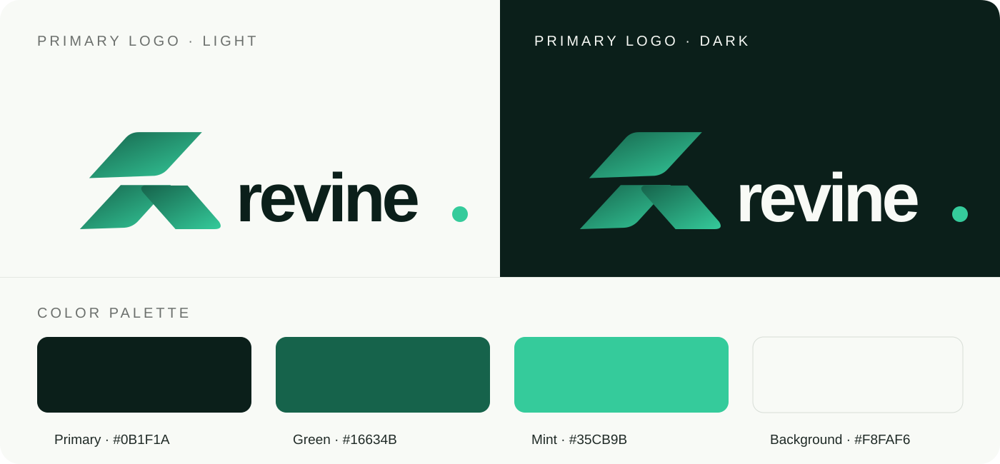
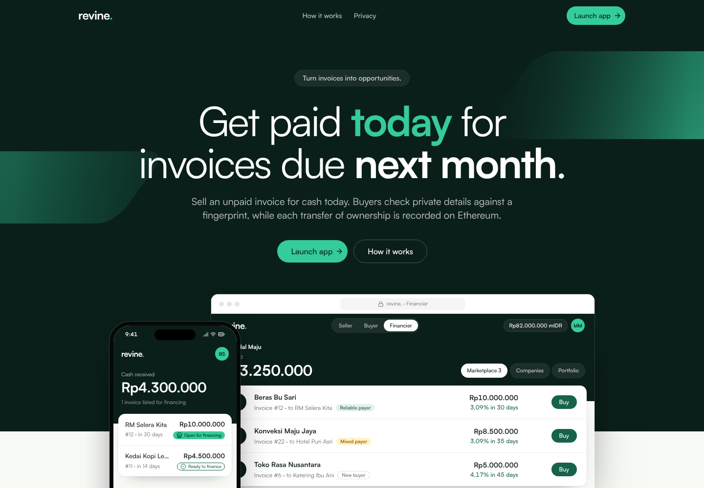
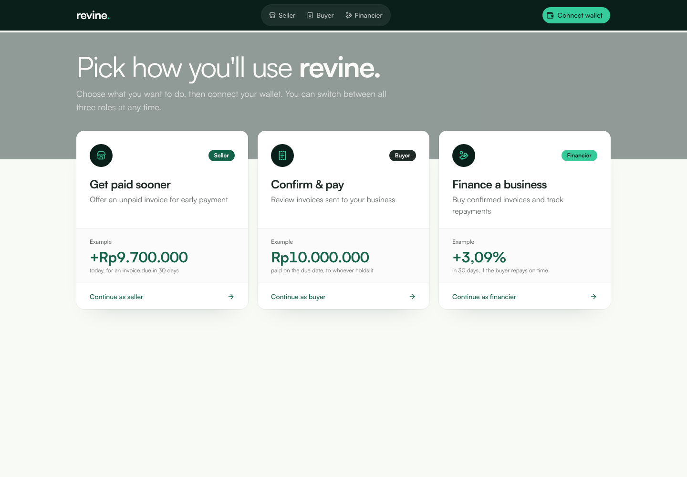

<p align="center">
  
</p>

<h1 align="center">Turn invoices into opportunities.</h1>

<p align="center">
  <a href="docs/assets/revine-logo-light.svg">Light logo</a> ·
  <a href="docs/assets/revine-logo-dark.svg">Dark logo</a> ·
  <a href="docs/assets/revine-mark.svg">App icon</a>
</p>

<p align="center">
  Revine helps Indonesian SMEs get paid sooner by connecting them with people who can finance their confirmed invoices.
</p>

<p align="center">
  <a href="https://revine-azure.vercel.app/app"><strong>Open the live demo</strong></a>
  · <a href="https://x.com/Revine_Eth">Follow Revine on X</a>
  · <a href="https://github.com/jopanmatthew/revine">View the source</a>
</p>

> **A testnet prototype:** The public demo runs on Ethereum Sepolia with test mIDR. It does not use real money. The current invoice contract uses a placeholder verifier, so zero-knowledge proof verification is not active in the public deployment.

## The problem

SMEs often deliver goods or services today but wait weeks to be paid. This cash-flow gap can make it hard to restock, pay staff, or take the next order. Traditional credit can be slow or out of reach, even when an SME has a valid invoice from a reliable buyer.

## How Revine helps

Revine gives the business a way to offer a confirmed invoice to a financier for early payment. The seller chooses the amount they are willing to accept today. If a financier buys it, the seller gets paid sooner, and the financier becomes entitled to the buyer's later repayment.

For example, on a **Rp10,000,000** invoice, a seller might accept **Rp9,700,000 today**. The Rp300,000 difference is the financier's potential return if the buyer repays the full invoice on time. Repayment still depends on the buyer.

## One invoice, five clear steps

1. **Create** an invoice and share it with the buyer.
2. **Confirm** — the buyer checks and confirms the amount.
3. **List** — the seller chooses an early-payment price.
4. **Finance** — a financier pays the seller and receives the invoice token.
5. **Repay** — the buyer pays the current token holder when the invoice is due.

The on-chain record tracks confirmation, listing, ownership, and repayment. Invoice line items and descriptions are kept off-chain and shared through the app with the seller and buyer. Wallet addresses, invoice and offer amounts, dates, and transaction history are public on the blockchain. Off-chain details are not end-to-end encrypted from the app's service.

## Take a look

<p align="center">
  
</p>

<p align="center"><em>The landing page explains the idea with a live financing example.</em></p>

<p align="center">
  
</p>

<p align="center"><em>Choose the role that matches what you want to do.</em></p>

## What is live today

- A public web demo at [revine-azure.vercel.app/app](https://revine-azure.vercel.app/app).
- A Sepolia deployment using test mIDR, not real currency.
- A smart contract that records invoice status, transfers the invoice token when financed, and sends repayment to its current holder.
- Invoice and credit proof circuits and generated verifier sources in the repository. The matching real verifiers have **not** been deployed to Sepolia yet.
- Demo credit evidence is synthetic and is not connected to a bank.

The public `RevineInvoice` contract points to `AlwaysTrueVerifier`, a test placeholder that accepts any proof. The demo therefore does **not** prove invoice validity or verify private facts with zero-knowledge proofs today. These contracts are for review and testing only.

## Try it

Open the [live app](https://revine-azure.vercel.app/app) to explore the interface. For a no-wallet walkthrough, run the local mock version:

```bash
cd apps/web
npm ci
cp -n .env.example .env.local
npm run dev
```

Open <http://localhost:3000>. The mock demo works without a wallet or secrets. It uses sample businesses and test data. Use Node.js 20.9 or newer. For the optional Sepolia setup, see [SETUP.md](SETUP.md).

## Deployed Sepolia contracts

Network: Ethereum Sepolia (`11155111`). These are test contracts; do not send real funds.

| Contract | Address | Explorer |
| --- | --- | --- |
| MockIDR (test token) | `0xf00642cb8069acd00707ccdaa1d0bac5af9828bf` | [Etherscan](https://sepolia.etherscan.io/address/0xf00642cb8069acd00707ccdaa1d0bac5af9828bf) |
| AlwaysTrueVerifier (placeholder) | `0xf958ff6652ae2f277074ba86f278c2cc0ef1b756` | [Etherscan](https://sepolia.etherscan.io/address/0xf958ff6652ae2f277074ba86f278c2cc0ef1b756) |
| RevineInvoice | `0x70ac14f38dac3a56d87ec18b604c61cb9471a59d` | [Etherscan](https://sepolia.etherscan.io/address/0x70ac14f38dac3a56d87ec18b604c61cb9471a59d) |

## For judges and contributors

- [Product and contract flow](docs/ARCHITECTURE.md) — what happens at each step and what is on-chain.
- [Setup guide](SETUP.md) — local demo, optional Sepolia configuration, and current limitations.
- [Web app](apps/web/) — the Next.js interface and API routes.
- [Smart contracts](contracts/README.md) — build, tests, deployment overview, and the verifier caveat.
- [Remix guide](contracts/remix/README.md) — optional wallet-signed deployment instructions for real verifiers.

## Tech

Next.js, TypeScript, Solidity, Foundry, Ethereum Sepolia, Noir circuits, and test mIDR.

---

Built to help good businesses keep moving while they wait to get paid.
