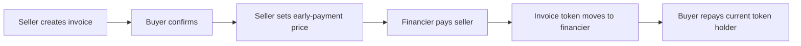

# How Revine works

Revine connects a business that is waiting on an invoice with a financier willing to pay sooner at an agreed discount. The buyer remains responsible for paying the invoice; financing does not guarantee that repayment will happen.

## The journey

1. **Create:** The seller enters the buyer, invoice amount, due date, and private invoice details.
2. **Confirm:** The buyer checks the invoice and confirms it from their wallet.
3. **List:** The seller sets the amount they are willing to accept today.
4. **Finance:** A financier buys the invoice using test mIDR. The contract transfers the invoice token to that financier.
5. **Repay:** The buyer pays the invoice amount to the address holding the token at repayment time.

If an invoice is for Rp10,000,000 and the seller accepts Rp9,700,000 today, the difference is a potential Rp300,000 return for the financier. That return depends on the buyer paying the invoice.

## What goes where

| Information | Where it lives | Who can see it |
| --- | --- | --- |
| Invoice status, wallet addresses, face amount, offer price, due date, and token owner | Ethereum Sepolia | Public |
| Invoice description and line items | App's off-chain details store | The app service; seller and buyer through the app |
| Invoice fingerprint | On-chain commitment | Public; it is a hash, not the invoice text |
| Demo credit revenue | Synthetic demo data | It is not bank-verified |

The off-chain invoice details are not end-to-end encrypted from the app's service. The on-chain face amount and offer price are public. Only the line-item details stay off-chain.

## What the prototype verifies today

The source tree includes Noir circuits and generated Solidity verifier sources for invoice and credit proofs. However, the deployed Sepolia `RevineInvoice` points to `AlwaysTrueVerifier`, which accepts any proof. Therefore, the public contract does not currently enforce those zero-knowledge checks. Proof mode must remain disabled until the matching real verifiers and a replacement invoice contract are deployed and configured.

The public app is a testnet prototype using test mIDR. It does not provide a lending service, guarantee buyer repayment, or handle real-world receivable assignment. See the root [README](../README.md) for the demo link and current contract addresses.
